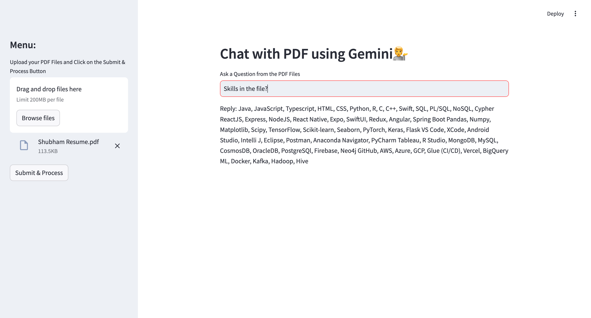

# Read your file with AI



## Overview
The PDF Information Extractor is a powerful application that utilizes the Langchain framework to read multiple PDF files and extract information based on user-defined prompts. This project is designed to simplify the process of retrieving specific information from large text PDF documents, making it an invaluable tool for researchers, students, and professionals alike.

## Features
- Multi-PDF Support: Read and process multiple PDF files simultaneously.
- Prompt-based Information Retrieval: Users can write prompts to extract specific information from the PDF documents.
- User-friendly Interface: Built with Streamlit for easy navigation and interaction.
- Efficient Text Processing: Leverages powerful libraries for parsing and searching through large text files.

## Technology Used
- Langchain: A framework for building applications powered by language models.
- Streamlit: A framework for building interactive web applications easily.
- Google Generative AI: To leverage generative models for enhanced text understanding and generation.
- python-dotenv: For managing environment variables conveniently.
- PyPDF2: A Python library for reading and manipulating PDF files.
- ChromaDB: A database for embedding storage and retrieval.
- faiss-cpu: A library for efficient similarity search and clustering of dense vectors.
- langchain_google_genai: Integration of Langchain with Google Generative AI.

## Run Locally
Clone the project

```bash
  git clone https://github.com/shubham-singh0109/pdf_GenAI_Reader.git
```

Go to the project directory

```bash
  cd pdf_GenAI_Reader
```

## Create a .env file and add your Gemini API Key
``` bash
  GOOGLE_API_KEY=<your_api_key_here>
```

## Installation
```bash
  pip install -r requirements.txt
```

## Run the Application
```bash
  streamlit run main.py
```
